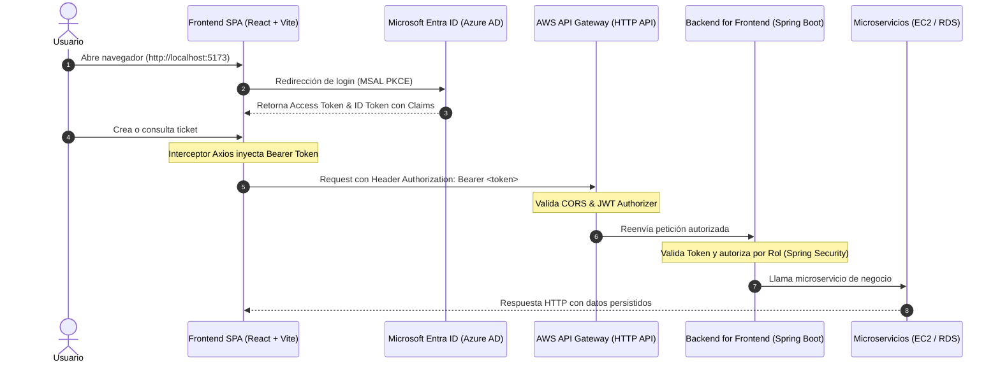

# MesaTech Cloud — Frontend Técnico

[](https://react.dev/)
[](https://vitejs.dev/)
[](https://tailwindcss.com/)
[](https://learn.microsoft.com/entra/identity/)
[](https://aws.amazon.com/api-gateway/)

---

## 📌 Descripción del Proyecto

**MesaTech Cloud** es una aplicación web Single Page Application (SPA) desarrollada en **React 18** y empaquetada con **Vite**, diseñada para resolver la centralización y trazabilidad de requerimientos e incidentes de soporte tecnológico B2B.

El frontend cumple dos funciones neurálgicas en la arquitectura Cloud Native:
1. **Autenticación Delegada:** Integra **Microsoft Entra ID (Azure AD)** mediante la librería oficial **MSAL (Microsoft Authentication Library)** para gobernar el inicio de sesión, el cierre de sesión y la emisión de tokens JWT de identidad y acceso utilizando el flujo *OAuth2 Authorization Code con PKCE*.
2. **Consumo Seguro de APIs:** Canaliza el 100% de las solicitudes de negocio a través de **AWS API Gateway (HTTP API)**, asegurando que ninguna llamada al backend se realice de forma directa y que todo tráfico vaya protegido con tokens Bearer válidos y bajo directivas estrictas de CORS.

---

## 🏛️ Flujo Arquitectónico



---

## 📋 Estado Actual de los Componentes

| Componente | Archivo Fuente | Estado | Descripción / Cobertura Funcional |
| :--- | :--- | :---: | :--- |
| **Autenticación MSAL** | `src/auth/authConfig.js`<br>`src/main.jsx` | ✅ **Listo** | Inicialización del cliente `PublicClientApplication`, configuración del tenant de Azure AD, persistencia en `sessionStorage` y plantillas condicionales (`AuthenticatedTemplate` / `UnauthenticatedTemplate`). |
| **Vistas por Rol** | `src/components/Navbar.jsx`<br>`src/components/TicketsManager.jsx` | ✅ **Listo** | Segmentación dinámica de la interfaz basada en el claim `roles` del JWT (`ROLE_ADMINISTRADOR`, `ROLE_OPERADOR`, `ROLE_CLIENTE`). Cambia títulos, accesos y columnas visibles. |
| **Interceptor de Axios** | `src/services/api.js` | ✅ **Listo** | Instancia centralizada de cliente HTTP que obtiene de forma silenciosa el token fresco (`acquireTokenSilent`) e inyecta la cabecera `Authorization: Bearer <token>`. |
| **Gestión de Requerimientos** | `src/components/TicketsManager.jsx` | ✅ **Listo** | Bandeja de tickets con soporte para estados (`CREADA`, `ASIGNADA`, `EN_PROCESO`, `RESUELTA`, `CERRADA`), badges semánticos y formulario de alta de incidencias. |
| **Inspección de Claims (Auditoría)** | `src/components/ClaimsViewer.jsx` | ✅ **Listo** | Componente técnico para visualizar los claims decodificados en vivo (`name`, `preferred_username`, `oid`, `roles`) durante demostraciones y pruebas de integración. |

---

## 🛠️ Requisitos y Tecnologías

### Requisitos del Sistema:
* **Node.js**: Versión 18.0.0 o superior (recomendado v20.x).
* **npm**: Gestor de paquetes oficial (v9.x o superior).

### Stack Tecnológico:
* **React 18**: Biblioteca frontend para renderizado declarativo y gestión del estado reactivo.
* **Vite 8**: Servidor de desarrollo con compilación HMR ultra rápida basada en ES Modules.
* **Tailwind CSS v4**: Motor CSS moderno de última generación cargado mediante `@import "tailwindcss"` para un diseño corporativo estilizado y responsivo.
* **Azure MSAL (`@azure/msal-browser` & `@azure/msal-react`)**: SDK oficial de Microsoft para integración OIDC/OAuth2 sobre Single Page Applications.
* **Axios**: Cliente HTTP para el consumo de servicios REST con soporte de interceptores asíncronos.

---

## ⚡ Instrucciones para Levantar el Entorno

Sigue estos pasos desde una terminal para ejecutar el proyecto en tu máquina local:

### 1. Clonar el repositorio y posicionarse en la raíz del frontend:
```bash
git clone https://github.com/Spacewalker-100/mesatech-frontend.git
cd mesatech-frontend
```

### 2. Instalar dependencias del proyecto:
```bash
npm install
```

### 3. Iniciar el servidor de desarrollo:
```bash
npm run dev
```

El servidor quedará disponible en:
```text
  VITE v8.3.0  ready in 180 ms

  ➜  Local:   http://localhost:5173/
  ➜  Network: use --host to expose
```

> [!WARNING]
> ### ⚠️ RESTRICCIÓN OBLIGATORIA DE PUERTO
> La aplicación **DEBE CORRER ESTRICTAMENTE EN EL PUERTO `5173`** (`http://localhost:5173`).
> 
> **Motivo técnico:** Microsoft Entra ID valida la URL de retorno contra el registro oficial de la aplicación (*App Registration*). Si el puerto cambia (por ejemplo a `5174` o `3000`), el proveedor de identidad **bloqueará la autenticación** arrojando el error `AADSTS50011: The reply URL specified in the request does not match the reply URLs configured for the application`.

### 4. Compilación para Producción:
```bash
npm run build
npm run preview
```

---

## 👥 Cuentas de Prueba (Azure AD / Microsoft Entra ID)

Para validar el control de acceso basado en roles (**RBAC**), el tenant institucional (`cvillarp.onmicrosoft.com`) cuenta con 3 perfiles de prueba preconfigurados con diferentes niveles de autorización:

| Perfil | Rol en Token (`roles`) | Identificador UPN | Nombre de Prueba | Permisos y Capacidades en la Interfaz |
| :--- | :--- | :--- | :--- | :--- |
| **Administrador** | `ROLE_ADMINISTRADOR` | `tonystark@cvillarp.onmicrosoft.com` | **Tony Stark** | • Acceso global irrestricto.<br>• Visualización de la **Bandeja Global de Solicitudes** con columna de usuario solicitante.<br>• Supervisión total de incidencias.<br>• Gestión y administración del catálogo corporativo (categorías y prioridades). |
| **Operador** | `ROLE_OPERADOR` | `bruce@cvillarp.onmicrosoft.com` | **Bruce Banner** | • Acceso a la **Bandeja Global de Requerimientos** para atención de incidentes.<br>• Visualización de solicitantes y detalles técnicos.<br>• Capacidad operativa para gestionar y transicionar estados de tickets (`Asignar`, `En Proceso`, `Resolver`). |
| **Cliente** | `ROLE_CLIENTE` | `peterparker@cvillarp.onmicrosoft.com` | **Peter Parker** | • Vista filtrada y restringida: **"Mis Solicitudes de Soporte"** (solo ve sus propios tickets).<br>• Permiso para **Crear nuevos requerimientos** mediante el formulario.<br>• Sin acceso a solicitudes de terceros ni a módulos administrativos. |

> [!NOTE]
> Al iniciar sesión con cualquiera de estas cuentas, la barra de navegación (`Navbar.jsx`) reconoce el rol directamente desde el claim `roles` del token y adapta las opciones y estilos en pantalla de manera instantánea.

---

## 🌐 Notas de Integración (Backend & AWS)

La integración entre la SPA de React, AWS API Gateway y el Backend for Frontend (BFF) implementa las siguientes consideraciones técnicas críticas:

### 1. Política de CORS (Cross-Origin Resource Sharing)
Para que el navegador permita las solicitudes HTTP desde el cliente local hacia la nube de AWS sin ser bloqueadas por la política de mismo origen (*Same-Origin Policy*), **AWS API Gateway** debe estar configurado con los siguientes parámetros:
* **Access-Control-Allow-Origin:** `http://localhost:5173`
* **Access-Control-Allow-Methods:** `GET, POST, PUT, PATCH, DELETE, OPTIONS`
* **Access-Control-Allow-Headers:** `Authorization, Content-Type, Accept`
* **Access-Control-Max-Age:** `300`

### 2. Inyección Automática del Token JWT (Interceptor Axios)
En [`src/services/api.js`](file:///src/services/api.js), todas las peticiones salientes pasan por un interceptor de Axios antes de salir a la red. El flujo implementado:
1. Solicita silenciosamente el token vigente a MSAL mediante `instance.acquireTokenSilent`.
2. Si el token está por expirar, MSAL lo refresca en segundo plano sin interrumpir al usuario.
3. Inyecta la cabecera estándar de autorización:
```javascript
config.headers.Authorization = `Bearer ${response.accessToken}`;
```
4. **AWS API Gateway (JWT Authorizer)** evalúa la firma criptográfica y el emisor (`Issuer`) de Microsoft Entra ID antes de enviar el tráfico a la instancia EC2 del BFF. Si el token no está presente o es inválido, API Gateway responde inmediatamente con `401 Unauthorized`.

### 3. Envío de Identificadores Numéricos (`categoriaId` y `prioridadId`)
Para asegurar la total compatibilidad con las entidades JPA y la base de datos relacional del backend de microservicios, el formulario de creación en [`src/components/TicketsManager.jsx`](file:///src/components/TicketsManager.jsx) garantiza la conversión estricta de tipos de datos en el evento `onChange`:
```javascript
const handleInputChange = (e) => {
    const { name, value } = e.target;
    // Convierte automáticamente a entero si el campo corresponde a un ID relacional
    setFormData({ 
        ...formData, 
        [name]: name.includes('Id') ? parseInt(value, 10) : value 
    });
};
```

**Payload JSON exacto generado hacia la API:**
```json
{
  "titulo": "Falla intermitente en conexión VPN",
  "descripcion": "El cliente de VPN corporativo pierde paquetes cada 10 minutos.",
  "categoriaId": 3,
  "prioridadId": 2
}
```
* `categoriaId`: `1` (Hardware), `2` (Software), `3` (Redes), `4` (Cuentas y Accesos).
* `prioridadId`: `1` (Baja), `2` (Media), `3` (Alta), `4` (Crítica).

Esta tipificación previene errores `400 Bad Request` por incompatibilidad de tipos entre String y Long/Integer en los controladores Spring Boot.

---

## 📌 Datos de Identidad del Tenant (Azure AD)

* **Tenant ID:** `d3701f96-7ab6-4c44-82b0-f6925953f544`
* **Client ID:** `fdc7e232-5931-4ca2-870e-4fa49ff4ac1c`
* **Dominio:** `cvillarp.onmicrosoft.com`
* **Redirect URI Registrada:** `http://localhost:5173`